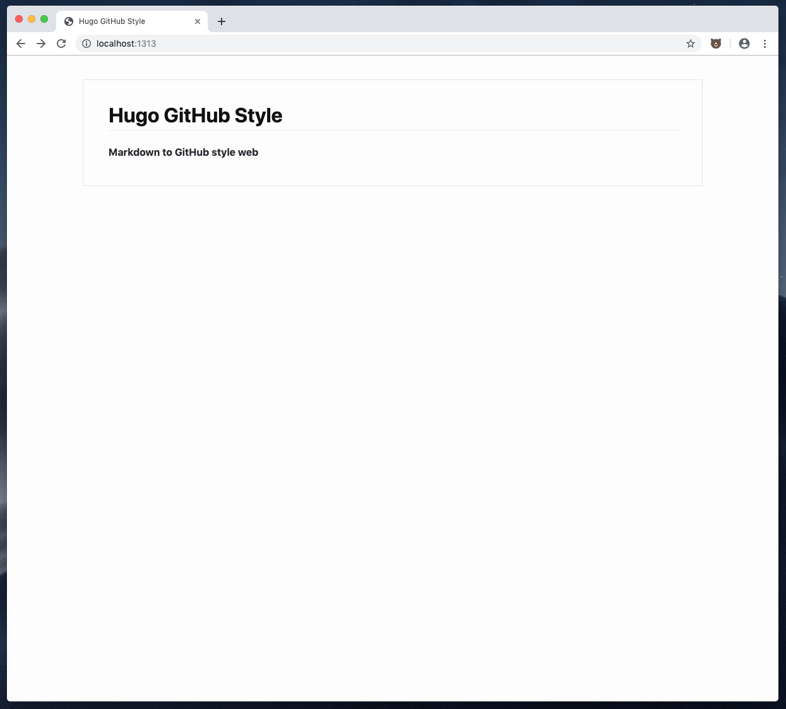

# hugo-gh-style
This is a Hugo "port" of the [KrauseFx/markdown-to-html-github-style](https://github.com/KrauseFx/markdown-to-html-github-style).




## Run the example
To get a feeling about this theme simply add some markdown files to the `exampleSite/content` directory and run:
```
cd exampleSite/ && hugo serve  --themesDir ../..
```

## Configuration
Currently there is no specific configuration available.

### config.yaml
The following is the only stuff you need inside your `config.yml`:
```
baseURL: http://hugo-gh-style.com
languageCode: en-us
title: Hugo GitHub Style
theme: hugo-gh-style
```

### posts headers
The header for each posts require only a `title` and (if wanted) the `draft` boolean:
```
---
title: "Markdown to GitHub style web"
draft: false
---
```
